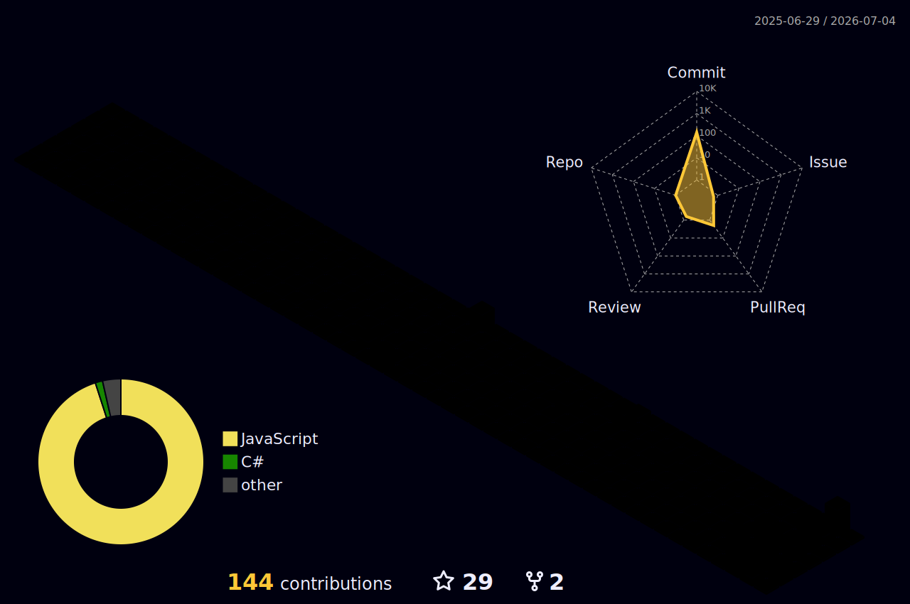

<p align="center">
  
</p>

<h1 align="center">Hi, I'm Mohammed Rashid 👋</h1>

<p align="center">
  <strong>Full-Stack Developer | Cyber Security Enthusiast | AI Learner</strong>
</p>

<p align="center">
  
</p>

---

## 🔮 3D Holographic Cyber Core

<p align="center">
  
</p>

---

## 📟 Cyber Terminal

> [!NOTE]
> ### terminal@rashid-rg:~$
> ```bash
> $ whoami
> mohammed_rashid (Developer // Hacker // Learner)
> 
> $ cat origin.json
> {
>   "location": "Sri Lanka 🇱🇰",
>   "mindset": "Build. Break. Secure. Improve.",
>   "fun_fact": "I debug faster with neon lights on 🌈"
> }
> 
> $ ping -c 1 future.me
> PING future.me (127.0.0.1): 56 data bytes
> 64 bytes from 127.0.0.1: icmp_seq=0 ttl=64 time=0.042 ms
> 
> --- future.me ping statistics ---
> 1 packets transmitted, 1 packets received, 0.0% packet loss
> Status: Success - Keep going.
> ```

---

## ⚔️ Tech Arsenal

<table align="center" border="0">
  <tr>
    <td align="center"><strong>Frontend</strong></td>
    <td align="center"><strong>Backend & Databases</strong></td>
    <td align="center"><strong>Systems & DevOps</strong></td>
  </tr>
  <tr>
    <td valign="top">
      
    </td>
    <td valign="top">
      
    </td>
    <td valign="top">
      
    </td>
  </tr>
</table>

---

## 📊 GitHub Analytics Dashboard

<p align="center">
  
  
</p>

<p align="center">
  
</p>

<p align="center">
  
</p>

### 🏆 Achievement Badges

<p align="center">
  
</p>

---

## 🗓️ 3D Contribution Calendar

*Your daily contribution logs mapped into a 3D isometric terrain:*

<p align="center">
  
</p>

*(See setup instructions in the repository files to enable this automatic daily rendering)*

---

## 🌐 Connect With Me

<p align="center">
  <a href="https://twitter.com/MrRashid" target="_blank">
    
  </a>
  <a href="https://linkedin.com/in/mohammed-rashid-mrm" target="_blank">
    
  </a>
  <a href="https://stackoverflow.com/users/15650117" target="_blank">
    
  </a>
  <a href="https://youtube.com/@sayitwell1" target="_blank">
    
  </a>
  <a href="https://instagram.com/its_me_rashid_rg" target="_blank">
    
  </a>
  <a href="https://rashidmrm.site/" target="_blank">
    
  </a>
</p>

<p align="center">
  <strong>⭐ If you like my projects, feel free to star them! ⭐</strong>
</p>
